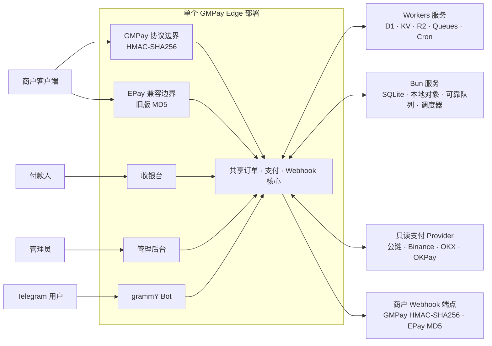

# GMPay Edge

**为边缘网络而生的多链支付网关**

简体中文 · [English](README.md)

[](LICENSE)
[](docs/zh-CN/DEPLOYMENT.md)
[](https://bun.sh/)
[](https://www.typescriptlang.org/)
[](https://react.dev/)
[](https://tanstack.com/start)
[](docs/zh-CN/DEPLOYMENT.md)
[](https://www.better-auth.com/)
[](https://vitest.dev/)
[](project.inlang/settings.json)

GMPay Edge 是可部署到 Cloudflare Workers 或 Bun/Nitro Docker 容器的自托管单租户加密货币支付网关。一个部署即可提供带签名的商户 API、响应式收银台、支付运营、动态角色权限、可靠的 Webhook 投递、定时处理和 Telegram 自动化。

它适合希望掌控支付基础设施，同时通过只读方式接入公链、交易所和数字钱包的运营者。商户是外部 API 客户端；运营人员与管理员统一使用受保护的 `/admin` 后台。

> [!IMPORTANT]
> GMPay Edge 仍在持续开发。内置接入表示相应能力已经实现，不代表该方式会自动达到生产可用状态或出现在收银台。生产使用仍需要部署者自己的端点或只读凭证、配置完成的收款方式、备份与监控，以及真实平台验收测试。

## 核心能力

- 通过 TRON、EVM 网络、TON、Aptos 和 Solana 接收付款。
- 通过 Binance、OKX 与 OKPay 只读适配器检测入账。
- 提供 GMPay 主商户协议，支持 JSON 与表单输入。
- 在 API 边界兼容 EPay，不维护第二套订单模型。
- 保留不可变支付快照，集中且幂等地处理订单状态流转与支付入账。
- 通过 Queue 支持的可靠 Outbox 投递商户回调，并保留重试历史、人工重试和审计记录。
- 使用 Better Auth、可选 TOTP 和动态多角色 RBAC 保护后台，包括受保护的内置 `root` 角色。
- 在两种运行时上通过可靠队列与定时任务执行支付扫描、过期处理、清理、连接健康检查和汇率同步。
- 使用 grammY 管理 Telegram Bot，支持 Inline 下单、公共指令，以及统一的私聊、群组和频道通知订阅。
- 提供 React 19 响应式后台、收银台、公共状态页、OpenAPI 文档和六语言界面。

## 支持的支付接入

| 类型 | 接入 | 内置资产 |
| --- | --- | --- |
| 链上网络 | TRON / TRC20 | USDT、TRX |
| 链上网络 | Ethereum / ERC20 | USDT、USDC、ETH |
| 链上网络 | Base | USDT、USDC、ETH |
| 链上网络 | BNB Smart Chain / BEP20 | USDT、USDC、BNB |
| 链上网络 | Polygon | USDT、USDC、MATIC |
| 链上网络 | TON | USDT、GRAM |
| 链上网络 | Aptos | USDT、USDC |
| 链上网络 | Solana | USDT、USDC |
| 交易所 | Binance | USDT、USDC |
| 交易所 | OKX | USDT、USDC |
| 数字钱包 | OKPay | USDT、TRX |

支付方式构成内置能力目录，收银台是否展示由可用的收款方式独立控制。收款方式必须配置所需的公共连接或只读账户信息并通过可用性检查，才能提供给付款人选择。

Provider 要求、限制、重试行为和生产检查清单参见[支付方式与收款方式](docs/zh-CN/PAYMENT_METHODS.md)。

## 系统架构



一个 Worker 或 Bun 容器承载全部产品入口以及共享的订单与支付核心。GMPay HMAC-SHA256 与旧版 EPay MD5 在明确的协议边界完成验签，随后共用订单服务、状态机、收银台和 Webhook 流水线；出站回调保留订单来源协议的签名格式。Workers 使用 D1/KV/R2/Queues/Cron，Bun 使用 SQLite、本地对象存储、可靠队列和调度器；支付适配器始终保持只读。

## 部署到 Cloudflare Workers

GMPay Edge 以单个 Cloudflare Worker 部署，并使用 D1、KV、私有 R2、两个 Queue 和 Cron Triggers。接受生产付款前，请完成[部署检查清单](docs/zh-CN/DEPLOYMENT.md)。

### 一键部署

[](https://deploy.workers.cloudflare.com/?url=https://github.com/GMWalletApp/gmpay-edge)

引导流程要求源仓库公开。它会配置 `wrangler.jsonc` 中声明的绑定、执行 D1 migration 并构建 Worker。Build command 使用 `bun run build`，Deploy command 使用 `wrangler deploy`。部署完成后访问 Worker 地址的 `/install` 初始化实例。

### Wrangler CLI

登录 Wrangler 后执行 package 部署命令：

```bash
bun install
bunx wrangler login
bun run deploy
```

如果需要手动准备 D1，依次执行 `bunx wrangler d1 create gmpay-edge` 和
`bun run db:migrate:remote`，生成的数据库 ID 不需要提交。

`predeploy` Hook 会精确复用环境中已有的同名 D1、KV、R2 和 Queue，只创建缺失资源；随后应用 D1 基线，并把解析到的 D1/KV ID 注入生成的部署产物。构建脚本不会向 `wrangler.jsonc` 写入账号专属 ID 或临时值。

部署声明以下绑定：

| 绑定 | Cloudflare 产品 | 用途 |
| --- | --- | --- |
| `DB` | D1 | 权威的应用、支付、授权与投递数据 |
| `CACHE` | KV | 短期已校验缓存与辅助遥测数据 |
| `FILES` | R2 | 私有付款复核凭证与生成的导出文件 |
| `PAYMENT_QUEUE` | Queues | 异步支付扫描 |
| `WEBHOOK_QUEUE` | Queues | 异步商户 Webhook 投递 |

现有 Workers 流程完全不变：`bun run build`、`bun run predeploy` 和
`bun run deploy` 继续使用 Cloudflare Vite 适配器。Bun 构建独立存在，不改变
Workers 产物。

## 使用 Bun 和 Docker 部署

公开的 [GHCR Package](https://github.com/orgs/GMWalletApp/packages/container/package/gmpay-edge)
支持 `linux/amd64` 与 `linux/arm64`。镜像已公开，无需登录 Registry。

根据使用场景选择镜像标签：

| 标签 | 用途 |
| --- | --- |
| `latest` | 推荐使用的最新稳定版 |
| `alpha` | 用于测试的最新预发布版 |
| `1.0.0` | 不会意外变化的固定版本 |

### Docker Compose（推荐）

将以下内容保存为 `compose.yml`：

```yaml
services:
  gmpay-edge:
    image: ghcr.io/gmwalletapp/gmpay-edge:latest
    restart: unless-stopped
    ports:
      - "3000:3000"
    environment:
      GMPAY_DATA_DIR: /var/lib/gmpay
    volumes:
      - gmpay-data:/var/lib/gmpay

volumes:
  gmpay-data:
```

```bash
docker compose pull
docker compose up -d
```

需要测试预发布版时，启动前将 `image` 中的 `latest` 改成 `alpha`。

### Docker 命令

不使用 Compose 时，可以直接运行相同的服务：

```bash
docker volume create gmpay-data
docker run --detach --name gmpay-edge --restart unless-stopped \
  --publish 3000:3000 \
  --env GMPAY_DATA_DIR=/var/lib/gmpay \
  --volume gmpay-data:/var/lib/gmpay \
  ghcr.io/gmwalletapp/gmpay-edge:latest
```

容器启动后访问 `http://your-host:3000/install`，确认公网地址和 Allowed Hosts，再
创建首位 root 用户。应用、安全和邮件设置均在后台维护，不需要增加其他容器环境
变量。

具名卷会保存数据库、上传文件、队列状态和全部运行数据。更新或重新创建容器时不要
删除该卷。使用 `curl --fail http://127.0.0.1:3000/healthz` 检查服务，使用
`docker compose logs --follow gmpay-edge` 查看日志。更新方式如下：

```bash
docker compose pull
docker compose up -d
```

生产检查请参阅[部署指南](docs/zh-CN/DEPLOYMENT.md)，备份、恢复和 Cloudflare 数据
迁移请参阅 [Bun 数据运维](docs/zh-CN/NODE_DATA_OPERATIONS.md)。

## 版本与容器镜像

`alpha` 的更新先由 semantic-release 按 Conventional Commits 发布为
`1.0.0-alpha.1`、`alpha.2` 等预发布版本；预发布镜像只写入完整版本和滚动
`alpha` 标签。验证完成并合并到 `main` 后再发布稳定 `1.0.0`，稳定镜像同时写入
major、minor 与 `latest` 标签。每次发布都会更新 `package.json` 和 `bun.lock`、创建
带自动生成说明的 GitHub Release 与 tag，再调用独立的 Docker smoke 与多架构 GHCR
工作流。原生 x64 与 Arm64 runner 会并行构建并 smoke，再发布组合 manifest。稳定版
发布后，匹配的 alpha GitHub 预发布、Git tag 与 GHCR 镜像版本会自动删除。

GHCR Package 已公开，正式版与预发布镜像均支持未登录拉取。

## 保持 Fork 自动同步

Fork 会包含 `Sync upstream` GitHub Actions 工作流。它每天 UTC 00:00 和 12:00 自动
运行，也可以通过 **Actions → Sync upstream → Run workflow** 手动触发。工作流会自动
识别 Fork 的上游仓库，并使用 GitHub 的 Fork 同步接口，将上游默认分支合并到 Fork 的
默认分支。

创建 Fork 后，请先打开其 **Actions** 页面并启用工作流；GitHub 默认不会直接启用新 Fork
中的工作流。该工作流只为仓库的 `GITHUB_TOKEN` 申请 `contents: write` 权限，不需要配置
Personal Access Token，也不会强推或覆盖 Fork 独有的提交。如果存在合并冲突，本次运行会
失败；手动解决冲突后，自动同步即可继续。

## 快速开始

### 环境要求

- [Bun](https://bun.sh/) 1.3 或更高版本
- [Wrangler](https://developers.cloudflare.com/workers/wrangler/) 支持的本地运行环境

安装依赖并启动开发服务器：

```bash
bun install
bun run dev
```

`bun run dev` 会将待执行的 migration 应用到本地 `gmpay-edge` D1 数据库，并在 <http://localhost:3000> 启动应用。本地开发使用 Wrangler 管理的本地绑定，不会对远程 D1 执行 migration。

首次运行访问 <http://localhost:3000/install>。安装会创建首位用户、受保护的 `root` 角色、运行密钥、支付默认数据、4 条包含六语言消息内容的公共 Telegram 指令和 Telegram 默认设置，并要求确认检测到的 Origin，再将其写入应用地址和 Allowed Hosts。完成后会自动登录并进入后台；安装不会创建 Telegram Bot，也不会请求 Telegram API。

登录页提供密码找回入口。多个邮件服务商在一级菜单“后台 → 邮件配置”中维护并
按顺序故障切换；Bun 与 Workers 显示同一组服务商类型。

安装完成后：

1. 在 `/admin` 检查自动生成的系统设置。
2. 确认自动识别的 HTTPS Origin，并备份运行配置。
3. 配置并测试所需的公共连接或只读凭证。
4. 为计划在收银台展示的资产创建收款方式。
5. 创建限定权限的商户 API 凭证，并完成一笔带签名的测试订单。

## 商户接入

GMPay 是主商户协议。EPay 是同一订单服务之上的兼容适配器，共享幂等规则、状态机、收银台、查询行为和回调流水线。

### 创建订单

```text
POST /payments/gmpay/v1/order/create-transaction
```

接口支持 JSON 与表单数据。请求包含数字凭证 `pid`，签名为使用凭证 Secret 作为 Key、对排序后的非空参数计算所得的小写 HMAC-SHA256。重复提交已有的 `order_id` 不会创建第二笔订单。`token` 与 `network` 同时省略时创建可选择支付方式的订单，不会静默默认到 TRON。

### 查询订单

```text
GET /payments/gmpay/v1/order/query
```

请求必须提供唯一的 `trade_id` 或 `order_id`，并使用同一凭证签名。凭证只能查询自己创建的订单。

### 接收回调

商户在创建订单时提供 `notify_url`。回调目标必须通过实例的 SSRF 与安全策略校验。已提交的订单事件会通过异步流水线投递，使用确定性签名，并保留投递尝试、执行有界重试、提供经审计的人工重试。接收端应校验签名、幂等处理重复事件，并在本地状态提交成功后再返回确认。

权威字段和状态值以运行实例的 `/docs` 页面或仓库中的 [OpenAPI 合约](public/openapi.yaml)为准。签名向量、回调参数、错误码和 EPay 路由参见[商户 API 指南](docs/zh-CN/MERCHANT_API.md)。

## 技术栈

| 模块 | 技术 |
| --- | --- |
| 运行时 | Cloudflare Workers 或 Bun/Nitro Docker |
| 应用 | React 19、TanStack Start/Router/Query/Table/Form |
| UI | Tailwind CSS 4、shadcn/Radix |
| 认证 | Better Auth |
| 授权 | 项目自有的动态 RBAC 与权限位掩码 |
| 数据 | Cloudflare D1 或 SQLite、Drizzle ORM |
| 运行时服务 | KV/R2/Queues/Cron 或本地缓存/对象/可靠队列/调度器 |
| Telegram | grammY、Telegram Bot API |
| 国际化 | ParaglideJS |
| 工具链 | Bun、严格 TypeScript、Vitest、Biome、Wrangler |

## 开发与质量

常用开发命令：

```bash
bun run dev
bun run db:migrate:local
bun run generate-routes
bun run typecheck
bun run test
bun run check
bun run build
bun run build:bun
```

每个 clone 执行一次 `bun run hooks:install`，即可启用本地 Lefthook Conventional
Commit 检查；commitlint 策略声明在 `package.json` 中。

只有在有意修改 Drizzle Schema 时才使用 `bun run db:generate`，并检查生成的 migration。
在不启动 Vite、但需要导入生成消息的检查前，运行 `bun run generate-paraglide`。
`src/paraglide` 已被忽略，不需要提交。

提交完整改动前，应在同一最终工作区运行质量门：

```bash
bun run typecheck
bun run test
bun run check
bun run build
bun run build:bun
```

测试分别位于 `tests/unit`、`tests/integration`、`tests/security` 和 `tests/e2e`。确定性 fixture 用于证明应用逻辑；保留的真实 Provider 套件会被自动化流程有意跳过，生产验收时必须使用部署者自己的基础设施人工执行。

## 文档

| 主题 | 文档 |
| --- | --- |
| 部署与生产签收 | [部署检查清单](docs/zh-CN/DEPLOYMENT.md) |
| Bun 备份、恢复与 Cloudflare 迁入 | [Bun 数据运维](docs/zh-CN/NODE_DATA_OPERATIONS.md) |
| Cloudflare 免费额度与优化 | [免费额度审计](docs/zh-CN/CLOUDFLARE_FREE_TIER.md) |
| 商户请求、签名、错误和 EPay | [商户 API](docs/zh-CN/MERCHANT_API.md) |
| Provider 配置与收款方式 | [支付方式](docs/zh-CN/PAYMENT_METHODS.md) |
| 入站端点与商户投递 | [Webhook](docs/zh-CN/WEBHOOKS.md) |
| Bot、Inline 下单、指令与订阅 | [Telegram](docs/zh-CN/TELEGRAM.md) |
| 认证、密钥、上传与响应策略 | [安全说明](docs/zh-CN/SECURITY.md) |
| 已实现能力与必需证据 | [能力矩阵](docs/zh-CN/CAPABILITY_MATRIX.md) |
| 机器可读 API 合约 | [OpenAPI YAML](public/openapi.yaml) |
| 运行时 API 文档 | 运行实例的 `/docs` |

## 安全

- 不要提交 `.dev.vars`、Bot Token、API Secret、私钥、助记词、交易所 Secret 或 Cloudflare 凭证。
- GMPay Edge 不保存提现权限、钱包私钥或助记词。交易所和数字钱包接入必须仅授予支付检测所需的最小只读权限。
- API 凭证 Secret、收款方式凭证和 Telegram Bot Token 会使用各自配置的应用层加密密钥加密后存储，仅在创建或轮换时显示，并在服务端需要时解析。
- 运行设置保存在权威数据库。运行时密钥原值只返回给拥有 `settings:read` 权限的管理员，以密码字段显示；更新时提交空值会保留当前内容。
- Better Auth 负责密码、Session 与可选 TOTP。生产使用前必须配置 Allowed Hosts、HTTPS、Origin 与 CSRF 校验、限流和邮件密码恢复；启用 TOTP 时还需确认并保留恢复码。
- 升级前备份 D1 或完整 Bun 数据目录；替换 `runtime.better_auth_secret` 会使现有认证材料失效。
- 回调目标、Provider 响应、上传文件、Queue 消息和 KV 值都是不可信边界。生产验收必须覆盖 SSRF、签名、权限路径、重试、重复事件和恢复行为。

公开实例前，请阅读[安全说明](docs/zh-CN/SECURITY.md)及部署检查清单中的安全内容。

## 致谢与许可证

产品调研参考了 [GMWalletApp/epusdt](https://github.com/GMWalletApp/epusdt)。除明确记录的边界适配外，GMPay Edge 不复制其协议或内部数据模型。

GMPay Edge 使用 [GPL-3.0-or-later](LICENSE) 许可证。
